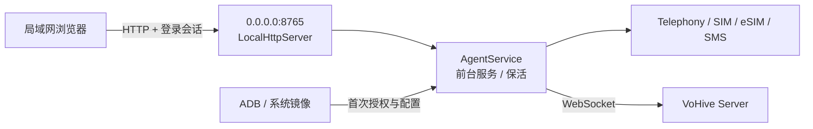

# VoHive Android Agent（无屏版）

Android Agent 以常驻前台服务运行，不提供 Launcher 或原生配置界面。服务在
`0.0.0.0:8765` 启动局域网 HTTP 管理站，手机、电脑和无屏设备使用同一套网页完成配置、
状态查看、SIM/eSIM 管理与短信收发。



## 功能

- PBKDF2-HMAC-SHA256 密码哈希、HttpOnly/SameSite 会话、CSRF 校验和登录限速；
- IMEI、IMSI、ICCID、手机号、固件、基带、电池、注册状态及蜂窝信号采集；
- 多 SIM/eSIM 枚举、当前订阅选择、eSIM 切换；
- 短信接收、长短信发送、回执、查询、读取和删除；
- 短信/eSIM 事件持久化排队、服务端确认和断线重发；
- 将 VoHive HTTP/SOCKS5 TCP 出口绑定到选定订阅的蜂窝网络；
- 前台服务、开机启动和 WebSocket 自动重连。

“停止上游”只断开 VoHive WebSocket，不会关闭前台服务或本地网页。管理站与设备保活属于
守护进程层，上游连接属于可独立启停的 Agent 层。

## 构建

需要 JDK 17、Android SDK 37、Gradle 9.4.1：

```bash
cd android-agent
./gradlew :app:assembleDebug
```

APK 位于 `app/build/outputs/apk/debug/app-debug.apk`。

## 无屏部署

打开无线或 USB ADB 后执行：

```bash
cd android-agent
ADB="$ANDROID_HOME/platform-tools/adb" \
WEB_USERNAME=admin \
WEB_PASSWORD='CHANGE_ME_12_CHARS' \
./scripts/provision-headless.sh SERIAL
```

脚本会安装 APK、授予普通运行时权限、申请默认短信角色、写入网页凭据并启动前台服务，
最后输出 Agent ID、局域网 URL、用户名和密码。监听地址固定为 `0.0.0.0`，默认端口为
`8765`，可通过 `HTTP_PORT` 修改。

ADB 首次配置通过受 `android.permission.DUMP` 保护的 Receiver 完成，再启动同样受保护且
`NoDisplay` 的 Bootstrap Activity，由它拉起非导出的前台服务；普通 Android 应用不能调用
配置或启动入口，设备上也不会出现原生界面。

也可在首次部署时同时连接 VoHive：

```bash
SERVER_URL='http://VOHIVE_LAN_IP:7575' \
DEVICE_ID='android-01' \
AGENT_ID='00000000-0000-0000-0000-000000000001' \
PAIR_TOKEN='VOHIVE_PAIR_TOKEN' \
WEB_PASSWORD='CHANGE_ME_12_CHARS' \
./scripts/provision-headless.sh SERIAL
```

未经过脚本直接启动时，Agent 会生成随机管理密码并写入 ADB 日志，可用以下命令读取：

```bash
adb -s SERIAL logcat -d -s VoHiveAgent:I
```

## 网页与 API

打开 `http://DEVICE_LAN_IP:8765/`。控制台提供：

- **总览**：上游连接、信号、电池、设备身份和权限矩阵；
- **蜂窝**：SIM/eSIM 列表、当前订阅选择和原始诊断快照；
- **短信**：按订阅发送短信、读取和删除短信；
- **设置**：VoHive 配对、开机启动、端口和管理凭据修改。

除静态登录页和 `POST /api/auth/login` 外，所有 `/api/*` 均要求有效会话；POST、PUT、
DELETE 还要求 `X-CSRF-Token`。管理接口不启用 CORS，并返回 CSP、禁止嵌入、禁止 MIME
嗅探等安全响应头。HTTP 仅面向可信局域网；需要跨不可信网络时应由上层网络提供 TLS/VPN。

## 真机测试

无短信发送/删除的冒烟测试：

```bash
ADB="$ANDROID_HOME/platform-tools/adb" ./scripts/adb-smoke-test.sh
```

完整联调会临时启动 VoHive，验证网页鉴权、自动配对、状态/订阅/短信 RPC 和蜂窝代理：

```bash
ADB="$ANDROID_HOME/platform-tools/adb" ./scripts/adb-e2e-test.sh
```

## 权限层级

运行时权限不能由无屏网页触发 Android 权限弹窗，因此由 ADB、Device Owner 或系统镜像在
部署阶段授予。普通侧载安装可使用短信、状态和活动订阅能力；完整硬件标识符、无交互 eSIM
切换、射频控制和设备重启需要默认短信角色、运营商特权、Device Owner 或系统特权。

系统镜像部署时，将平台签名 APK 放入 `priv-app/VoHiveAgent/`，并安装：

- `system/privapp-permissions-com.vohive.agent.xml` → `etc/permissions/`
- `system/default-permissions-com.vohive.agent.xml` → `etc/default-permissions/`

`ComposeSmsActivity` 仅作为 Android 默认短信角色所需的 NoDisplay 合约组件存在；Agent 不含
可见的 Android 管理 UI。eSIM 需要用户确认时仍可能由系统显示平台确认界面。
